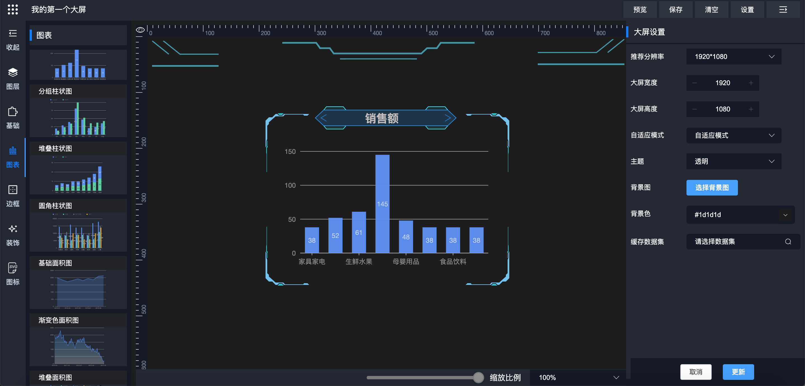

## 📚简介
<p align="center">
  
</p>

🔥基于SpringBoot、MyBatisPlus、ElementUI、G2Plot、Echarts等技术栈的大屏设计器，具备大屏目录管理、大屏设计、大屏预览能力，支持MySQL、Oracle、PostgreSQL、JSON等数据集接入，对于复杂数据处理还可以使用Groovy脚本数据集，使用简单，完全免费，代码开源。

<p align="center">
    
  
  
    
  
    
</p>

-------------------------------------------------------------------------------

## 效果图




## 优势

* 全套大屏解决方案，从**数据处理**->**大屏设计**->**大屏预览**->**实际使用**
* 支持多种数据集接入，可用于实际生产
* 支持独立部署，不对原有工程产生影响
* 支持嵌入式集成，与项目无缝融合，减少运维成本
* 支持自定义接口权限、数据权限，保证大屏数据安全

## 📝 文档

[📘中文文档](https://www.yuque.com/chuinixiongkou/bigscreen/index)

## 📦 如何集成

### 1. 安装依赖

``` bash
npm install gc-starter-bigscreen-ui
```

### 2. 在 `main.js` 引入大屏
```javascript
// file: main.js

// 组件依赖 element-ui，项目已有element-ui可以忽略此步骤
import ElementUI from 'element-ui'
import 'element-ui/lib/theme-chalk/index.css'
Vue.use(ElementUI, { size: 'mini' })

// 引入大屏css
import 'gc-starter-bigscreen-ui/lib/bigScreen.css'
```

###  3. 在 `main.js` 配置大屏

**方式一：后端服务地址配置在`.js`文件中**

```javascript
// file: xxx.js

window.CONFIG.baseUrl=http://127.0.0.1:8081/bigScreenServer
```

```javascript
// file: main.js

import { registerConfig } from 'gc-starter-bigscreen-ui'
registerConfig({
  httpConfigs: {
    baseURL: `这里是后端服务地址的值，如：window.CONFIG.baseUrl`
  }
}, router)
```

**方式二：后端服务地址配置在`.env文件中**

```javascript
// file: .env.development

VUE_APP_BASE_URL=http://127.0.0.1:8081/bigScreenServer
```

```javascript
// file: main.js

import { registerConfig } from 'gc-starter-bigscreen-ui'
registerConfig({
  httpConfigs: {
    baseURL: `这里是后端服务地址的值，如：process.env.VUE_APP_BASE_URL`
  }
}, router)
```

### 4.  `vuex`模块新增大屏`store`

```js
// file: 项目中导出strore的文件

import { $bigScreen } from 'gc-starter-bigscreen-ui'
const store = new Vuex.Store({
  modules: 
    // 导出大屏所需vuex模块
    bigScreen: $bigScreen.bigScreenStore
  }
})
export default store

```

### 5. 访问大屏

启动项目后，访问前端地址 http://ip:port/management


## 演示DEMO

<a href="http://gcpaas.gccloud.com/bigScreen"> http://gcpaas.gccloud.com/bigScreen </a>

## 联系我们


## License

Apache License 2.0
